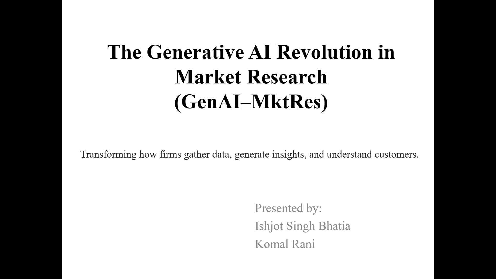
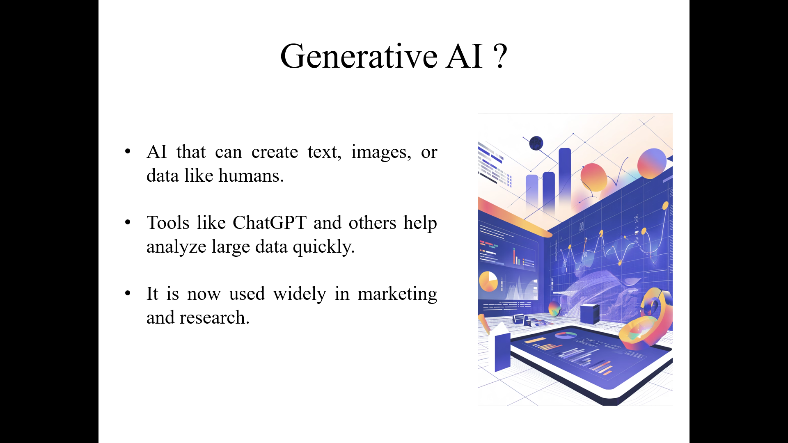
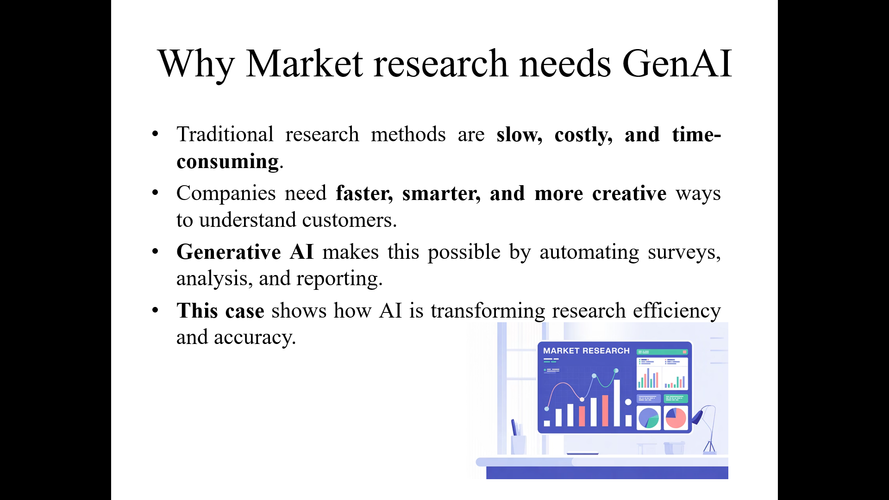
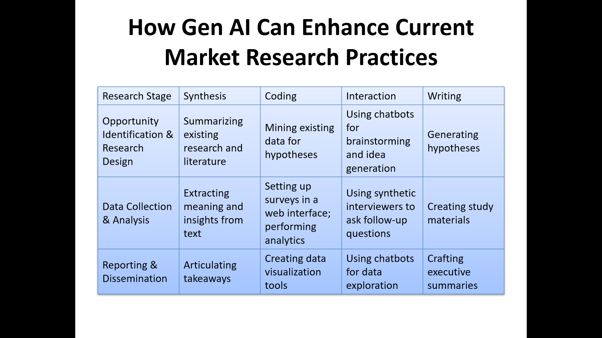
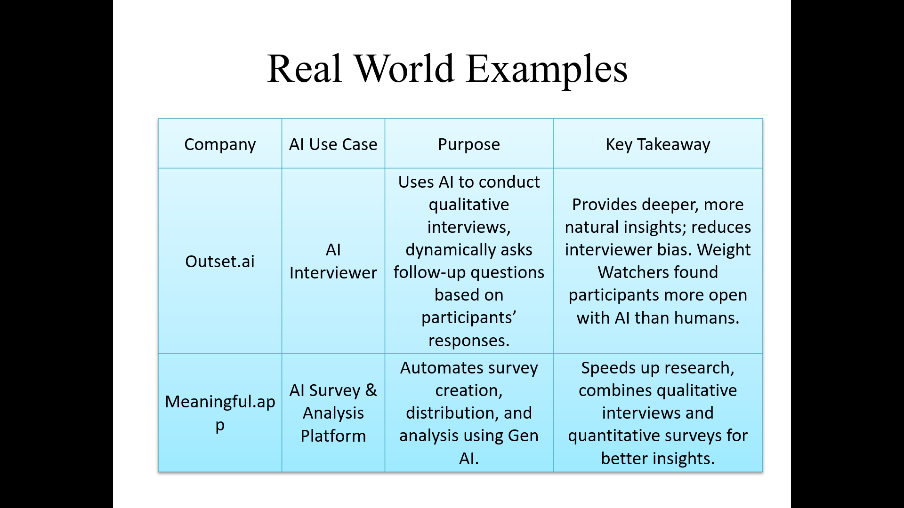
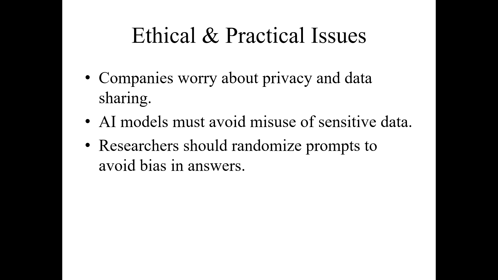
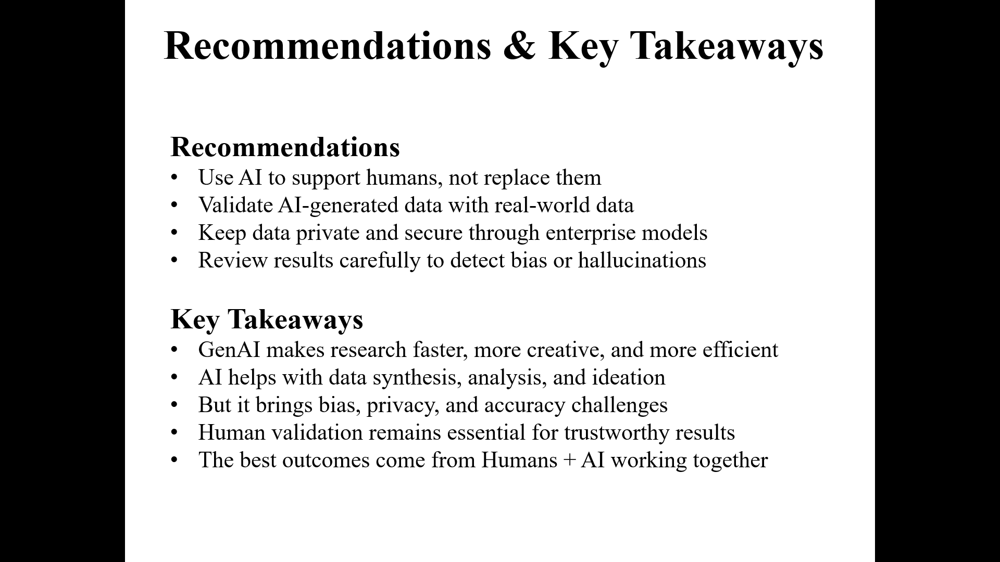

# The Generative AI Revolution in Market Research

### Case Analysis

### MBA – First Year | Foundation of Marketing Management (FMM)

---

## Overview

This repository contains my academic presentation prepared as part of the **Foundation of Marketing Management (FMM)** course during my **MBA First Year**.
The project analyzes how **Generative AI (GenAI)** is transforming modern **Market Research**. It summarizes key concepts from the assigned case, along with my own interpretation of how GenAI improves research efficiency, creativity, and insight generation.

This README serves as a clear summary of the project structure and the insights presented in the PPT.

---


## Repository Contents

```
📁 GenAI-Market-Research/
│
├── GenAI_MktRes.pptx   ← My original PPT (analysis only)
│
└── README.md            ← Case Study summary
```

---

## 1. Introduction

Generative AI refers to advanced AI systems capable of creating **text, images, and data** that resemble human output.
In market research, GenAI provides companies with faster insights, deeper understanding of customers, and new ways to simulate behavior.

This project highlights how GenAI is reshaping the industry across all stages of the research process.



---

## 2. Why Market Research Needs GenAI

Traditional research methods are often:

* Time-consuming
* Expensive
* Hard to scale
* Limited in creativity

GenAI solves these gaps by:

* Automating tasks like summarization and survey design
* Speeding up analysis
* Generating synthetic data
* Supporting decision-making with instant insights


---

## 3. Four Major Opportunity Areas


### 3.1 Supporting Current Practices

GenAI enhances existing workflows by:

* Summarizing research literature
* Extracting themes from interview transcripts
* Designing surveys and study materials
* Creating high-quality research reports

### 3.2 Replacing Current Practices with Synthetic Data

GenAI can create **synthetic respondents** and **synthetic survey data** that help:

* Simulate customer decisions
* Predict behavior
* Reduce data collection cost
* Test early-stage hypotheses

### 3.3 Filling Existing Gaps

GenAI fills gaps where real data is unavailable or costly by:

* Generating market insights instantly
* Testing assumptions
* Providing competitor intelligence
* Aiding strategic decision-making

### 3.4 Creating New Kinds of Data & Insights

GenAI enables innovations such as:

* **Digital twins** of customers
* Behavioral simulations
* Virtual sales training environments
* Pre-testing marketing messages

---


## 4. Limitations and Ethical Considerations

Although powerful, GenAI has limitations such as:

* Bias in generated responses
* Less variation than real human data
* Unstable long-term reproducibility
* Inability to fully capture emotions or sensory reactions
* Data privacy concerns

Human validation remains essential for accurate and ethical results.


---

## 5. Recommendations

Based on the analysis, the project recommends:

* Use GenAI to **support**, not replace, human researchers
* Validate synthetic data with real-world findings
* Ensure data privacy through secure, enterprise AI systems
* Check for hallucinations and model bias
* Combine human expertise with AI speed for the best outcomes

---

## 6. Key Takeaways

* GenAI is reshaping market research by making it **faster, smarter, and more creative**
* It enhances data synthesis, ideation, and decision-making
* Synthetic data and digital twins open new opportunities
* Ethical and accuracy issues require careful oversight
* The future of research relies on **Human + AI collaboration**

---

## 7. Disclaimer

This repository includes **only my original work** (presentation and summary).
The **copyrighted case study PDF is not included**.


Note *(Only my original analysis and PPT are included. The original case PDF is **not uploaded** due to copyright restrictions.)*
